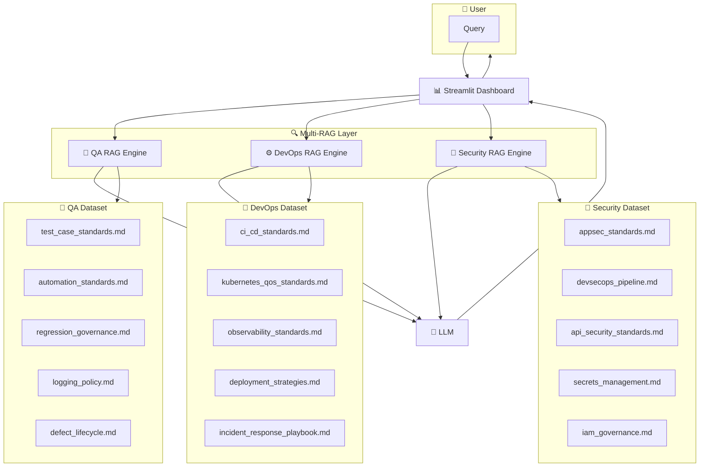

# AI-Assisted-QA-Toolkit Architecture

This document describes the architectural design of the **AI-Assisted-QA-Toolkit**, including module structure, data flow, integration points, and AI components.

---

## 1. High-Level Overview

The toolkit is organized into modular components that can be used independently or combined to create an AI-enhanced QA workflow.

Core pillars:
- **AI-powered generation** (test cases, scripts)
- **AI-powered analysis** (logs, regression, risk)
- **Dashboard visualization**
- **Extensible architecture for future AI integrations**

---

## 2. Architecture Diagram (Conceptual)

```text
+---------------------------+
|     Requirements Input    |
+-------------+-------------+
|
v
+---------------------------+
|  AI Test Case Generator   |
+-------------+-------------+
|
v
+---------------------------+
|  AI Test Script Generator |
+-------------+-------------+
|
v
+---------------------------+
|   Regression Optimizer    |
+-------------+-------------+
|
v
+---------------------------+
|   Log & Error Analyzer    |
+-------------+-------------+
|
v
+---------------------------+
|   AI QA Dashboard (UI)    |
+---------------------------+

```

## 2.1 Multi‑RAG Architecture (Mermaid)

# 📘 **Here is the Mermaid diagram formatted for architecture.md**


---

## 3. Module Breakdown

### **3.1 Test Case Generator**
- Input: raw requirements (text)
- Output: structured test cases (Gherkin, JSON, Markdown)
- Components:
  - Prompt templates
  - LLM interface
  - Validation layer

### **3.2 Script Generator**
- Input: test cases or requirements
- Output: Playwright/Cypress scripts
- Components:
  - Code templates
  - AI-assisted code generation
  - Framework adapters

### **3.3 Log & Error Analyzer**
- Input: logs, stack traces, execution reports
- Output: root cause suggestions, classification, prioritization
- Components:
  - Log parser
  - LLM classifier
  - Risk scoring engine

### **3.4 Regression Optimizer**
- Input: test suite metadata
- Output: recommendations for cleanup, new tests, duplicates
- Components:
  - Test metadata extractor
  - AI-based similarity analysis
  - Risk-based prioritization

### **3.5 Dashboard**
- Built with Streamlit
- Displays:
  - Test execution status
  - AI insights
  - Risk indicators
  - Recommendations

---

## 4. AI Layer

### **LLM Integration**
Supports:
- OpenAI
- Azure OpenAI
- Local models (future roadmap)

### **RAG (Retrieval-Augmented Generation)**
Used for:
- Domain-specific QA knowledge
- Documentation-based reasoning

### **Embeddings**
Used for:
- Similarity search
- Duplicate test detection
- Log clustering

---

## 5. Extensibility

The architecture supports:
- Plug-in modules
- Custom LLM providers
- Additional QA frameworks
- CI/CD integration

---

## 6. Future Enhancements

- Fine-tuning for domain-specific QA
- Multi-agent QA workflows
- CI/CD pipeline integration
- Real-time monitoring

